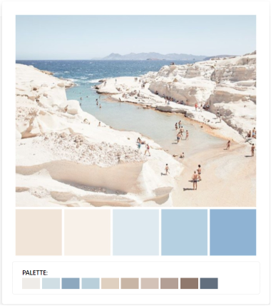

<h1 align="center">Greek Beaches Memory Game</h1>

For my milestone project 2, I have made a memory card game with a greek theme.
With every card you click you will discover another beautiful beach in Greece. 
For this game I have chosen my favourite, less touristic and less known beaches around Greece.
This game will inspire you to discover more of Greece in a fun way!


## User Experience (UX)

### User stories


  - As a Visitor,

    1. I want to see an explanation of the game, before I proceed to the game.
    2. When playing the game, I want to be challenged.
    3. I want to be able to play suitable music if I want to.
    4. I want to have the option to restart the game if I feel like I failed halfway.
    5. I want the website and the cards to be visually pleasing.
    6. When I don't finish the game in time, I want to easily restart the game.
    7. When I win the game, I want to see in how much time and flips I finished the game and restart if I want to improve.


### Strategy
The goal of this website is to make a fun, challenging, and visually pleasing memory game to inspire the players to discover more of Greece.

### Scope
Instead of using pictures of well known greek beaches, the cards shows less touristic and less known beaches to amaze the players with every click.
The game is challenging because the pictures of the beaches look similar and you only have 60 seconds to find them all.

### Structure
When opening the website you will be welcomed by a landing page, which will show a very nice background and a jumbotron with the game instructions and a button to start the game.
The game will have a navbar with 2 modern looking buttons in the middle. One to restart the game, and the other one to start or pause the music.
Music will not autoplay for a better user experience. The game container has 4x4 cards with a greek style but simple background. 
The cards will be as wide as possible to prevent pixellation. Above the cards you will find the timer and the flip counter.
Once you win or you run out of time, there will be a modal. When the time's is up, it will give you the option to start again.
If you found all the pairs within 60 seconds, a modal will appear with the amount of flips, and how many seconds it took you to find all the cards and a button to start the game again.

### Surface
I wanted to make a modern, symmetric, and visually pleasing looking game. I wanted to avoid it looking childish or mixed with too many colors.
#### Colour Scheme
 - I've ran a color scheme with a picture of a beach in Milos,Greece that I found on [Pinterest](https://www.pinterest.com/pin/465137467771700654/) through on [imagecolorpicker](https://imagecolorpicker.com/) to find more color options.
 - The main colours used are: dark blue/grey (#343d47), grey, white (#fafafa) and blue.
 
#### Typography
 - The font-family used is Montserrat. It looks clean and suits visually.
#### Imagery
 - Background of the card has a greek themed pattern, but looks sleak, modern and clean.
 - Pictures chosen for the beaches are meant to amaze the player.
 - The favicon represents the background of the cards but smaller. So when users see this in their browser they are reminded of the style of the game.


### Skeleton
- Desktop, tablet and phone Wireframes of the game - [View](/assets/img/wireframe1.jpg)
- Start modal wireframes - [View](/assets/img/wireframe2.jpg)
- Win and game over wireframes - [View](/assets/img/wireframe3.jpg)


## Features

-   Responsive on all device sizes
-   Interactive elements
-   Well-Formatted Content 
-   Browser Consistency
-   Contrasting Colour Scheme


## Technologies Used

### Languages Used

-   [HTML5](https://en.wikipedia.org/wiki/HTML5)
-   [CSS3](https://en.wikipedia.org/wiki/Cascading_Style_Sheets)
-   [Javascript](https://en.wikipedia.org/wiki/JavaScript)

### Frameworks, Libraries & Programs Used

1. [Bootstrap 4.4.1:](https://getbootstrap.com/docs/4.4/getting-started/introduction/)
    was used to assist with the responsiveness and styling of the website and to make the navbar and jumbotron on the landing page.
2. [Google Fonts:](https://fonts.google.com/)
    were used to import the font-family 'Montserrat' into the style.css file.
3. [Font Awesome:](https://fontawesome.com/)
    was used to add social media icons in the footer.
5. [Git:](https://git-scm.com/)
    was used for version control. In the terminal of Gitpod, I used Git to add and commit to Git and after pushing it to Github.
6. [GitHub:](https://github.com/)
    is used to store and share my project.
8. [Balsamiq:](https://balsamiq.com/)
    was used to create the wireframes during the design process.
9. [TinyPNG:](https://tinypng.com/)
    was used to compress the images.
10. [Redketchup:](https://redketchup.io/image-resizer) 
    was used to resize the images.
11. [Freefrontend:](https://freefrontend.com/css-buttons/)
    was used to find the interactive buttons.
12. [Photopea:](https://www.photopea.com/)
    is an online photo editor and I used it to improve the colors of the background of the cards.
13. [Ytmp3:](https://ytmp3.cc/)
    used to convert the youtube video where the background song is found in, into mp3.
14. [Mp3cut:](https://mp3cut.net/)
    used to cut the converted track.

## Testing

The following validators were used to make sure there were no syntax errors in the project.

-   [W3C Markup Validator](https://jigsaw.w3.org/css-validator/#validate_by_input)
    Tells me the following error on every card:
    Bad value for attribute src on element img: Must be non-empty.
    Keeping the src empty in HTML, but filling this space up with Javascript, is the way I made the shuffeling work.

-   [W3C CSS Validator](https://jigsaw.w3.org/css-validator/#validate_by_input) - No errors

-   [JSHint](https://jshint.com/)
    I get 25 warnings, mostly repeating, about some features that are only available in ES6 or Mozilla JS extensions.
    Warnings are:

    - 'const' is available in ES6 (use 'esversion: 6') or Mozilla JS extensions (use moz).
    - 'let' is available in ES6 (use 'esversion: 6') or Mozilla JS extensions (use moz).
    - 'arrow function syntax (=>)' is only available in ES6 (use 'esversion: 6').
    - 'template literal syntax' is only available in ES6 (use 'esversion: 6').

    I also get that the 2 '$' used as jQuery to call the modals, are undefined variables.


Lighthouse in chrome was also used to test the website.
-   [Results]()

### Testing User Stories from User Experience (UX) Section

-   #### Visitor Goals

    1. As a Visitor, I want to see an explanation of the game, before I proceed to the game.
    2. As a Visitor, when playing the game, I want to be challenged.
    3. As a Visitor, I want to be able to play suitable music if I want to.
    4. As a Visitor, I want to have the option to restart the game if I feel like I failed halfway.
    5. As a Visitor, I want the website and the cards to be visually pleasing.
    6. As a Visitor, when I don't finish the game in time, I want to easily restart the game.
    7. As a Visitor, when I win the game, I want to see in how much time and flips I finished the game and restart if I want to improve.

### Functional Testing


### Further Testing

-   The Website was tested on Google Chrome, Microsoft Edge and Safari browsers.
-   The website was tested on all device sizes that are viewable in DevTools.
-   Family members and friends were asked to test the website on their devices.
-   The website was viewed on a variety of devices:

    Desktop:
    - HP Spectre Notebook
    - Sony VAIO Fit15E (laptop)
    - Acer Predator G5900 (computer)
    - ASUS 18363 (computer) 
    - ASUS N73S (laptop)

    Mobile:
    - Samsung Galaxy A41
    - Samsung Galaxy S7 2017
    - Samsung Galaxy A70
    - Huawei Y60 2018
    - Huawei P30 Pro

### Known Bugs

- The cards flip too fast on mobile. I tried to fix it with the time out in JS, but then it flips too slowly on desktop. Eventually gave the flipping a time out of 100.
- When you find all the matches at 0 seconds, it shows both modals.
- You do not see the background slide on the buttons clearly on mobile.

## Deployment

### GitHub Pages

I deployed the project to GitHub pages using the following steps:

1. Log in to [GitHub](https://github.com/) and navigate yourself to the repository.
2. At the top of the Repository, click on "Settings" in the menu.
3. Scroll down the page until you find the "GitHub Pages" Section.
4. Under "Source", click the dropdown called "None" and select "Master Branch".
5. The page will automatically refresh.
6. Scroll back down the page to locate the now published [site](https://kristinabog.github.io/greek-beaches-memory-game/) in the "GitHub Pages" section.

### Forking the GitHub Repository

To view and/or to make changes to the repository without it affecting the original, you can fork the GitHub Repository with the following steps:

1. Log in to [GitHub](https://github.com/) and navigate yourself to the repository.
2. At the top of the Repository under the repo's name, above the "Settings" Button on the menu, click on the "Fork" Button.
3. You will now find a copy of the original in your account.

### Making a Local Clone

1. Log in to [GitHub](https://github.com/) and navigate yourself to the repository.
2. Click the 'Code' dropdown above the file list.
3. Copy the URL for the repository.
4. Open Git Bash
5. Change the current working directory to where you want the cloned directory.
6. Type git clone in the CLI and then paste the URL you copied earlier.
   It should look like this:
```
$ git clone https://github.com/kristinabog/greek-beaches-memory-game
```
7. Press enter to create clone

## Credits

### Code

-   [Bootstrap4](https://getbootstrap.com/docs/4.4/getting-started/introduction/): 
Bootstrap Library used throughout the project for the creation of the navbar, jumbotron, layout and responsiveness.

-   [Freefrontend](https://codepen.io/atloomer/pen/JEaRWX):
Used for the buttons: 'start the game' on the landing page, 'restart' and 'music' in the game.html

- Javascript for the game inspired by the following Youtube videos:

    [Inspiration for the shuffle function](https://www.youtube.com/watch?v=QrTCHHhoUQU&ab_channel=codeTonight)

    [Inspiration on the flip, match and reset functions](https://www.youtube.com/watch?v=ZniVgo8U7ek&ab_channel=freeCodeCamp.org)

-   [Code to not display extra white space of the right side of website](https://stackoverflow.com/questions/4617872/white-space-showing-up-on-right-side-of-page-when-background-image-should-extend)

-   [Vertically aligning the modal](https://stackoverflow.com/questions/18053408/vertically-centering-bootstrap-modal-window)

### Images

You will find the pictures in this section by the name of the card image files from the folder 'cards'.

gidaki.jpg is my own picture taken in Gidaki Beach in Ithaca.

Pixabay.com:

- [Apelles](https://pixabay.com/photos/greece-beach-sea-karpathos-3997319/): Apelles beach in karpathos
- [Navagio](https://pixabay.com/photos/bay-navagio-navagio-bay-sea-greece-1266410/): Navagio Beach in Zakynthos
- [Myrtos](https://pixabay.com/photos/kefalonia-myrtos-beach-greece-4316318/): Myrtos Beach in Kefalonia
- [Landing page background](https://pixabay.com/photos/beach-greece-blue-lefkada-sea-2718897/)

Other:

- [Porto-katsiki](https://unsplash.com/photos/epiM8o5Wiug): Porto Katsiki Beach in lefkada
- [Voutoumi](https://upload.wikimedia.org/wikipedia/commons/2/24/Voutoumi_beach_at_Antipaxoi_from_the_hill.jpg): Voutoumi Beach in Antipaxos
- [Kolona](https://images.robertharding.com/zoom/RM/RH/HORIZONTAL/841-1096.jpg): Kolona Beach in Kythnos
- [Stravnam](https://shutterstock.com): Stravnam Beach in Meganisi
- [Background image on the cards and favicon](https://pixtastock.com)

### Audio

- [The background audio](https://www.youtube.com/watch?v=o5Y3nwtIdvw&ab_channel=MaximusConfese)
    was cut out of this video on youtube from 03:24.

- All other soundeffects from [Zapsplat.com](https://www.zapsplat.com/)

### Acknowledgements

-   My Mentor for the helpful feedback.

-   A very big thank you to the Tutor support who helped me solve bugs.

-   A thank you to family and friends that took the time to test the website.

